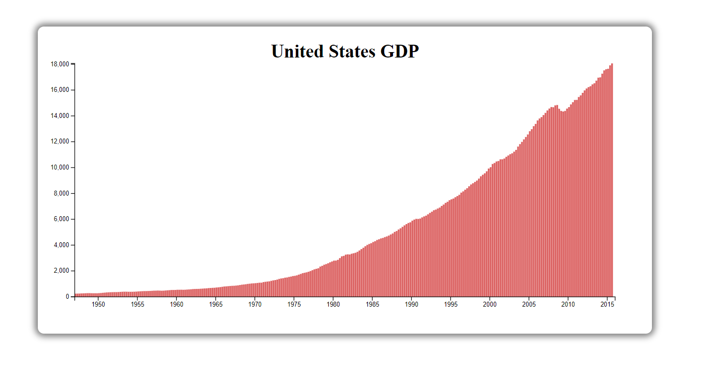

# D3: Bar Chart

 A simple program page that that visualise data with a Bar Chart using D3.js, made for FreeCodeCamp certification Project using HTML, CSS, JavaScript and D3.js

## Usage

 Open the index.html file with a browser.
 The page Will automatically generate a Bar Chart for US GDP using D3.js

## Testing

 this project was made using **react** and to test the if the site fulfils all the requirements, you can run the ***test suite*** at the top left and select **D3: Bar Chart** from the dropdown menu and press the *run tests* button, view the results by clicking the button below it which shows how many tests were run.

## Page Preview

 **View/Use this app on Code Pen:** [Drum Machine Live](https://codepen.io/PHULUSO-SINGO/full/LEPdeJO).

 
